# 🎬 QuickShow – Movie Ticket Booking System

QuickShow is a modern **movie ticket booking web application** built using **React** and **Tailwind CSS**.  
It allows users to browse movies, view details, select seats, and book tickets with secure authentication.

---

## 🚀 Features

- 🎥 Browse trending and popular movies using TMDB API
- 🔍 View detailed movie information
- 💺 Seat selection with availability handling
- 🔐 Secure authentication using Clerk
- 🎟️ Ticket booking workflow
- 📱 Fully responsive UI with Tailwind CSS
- ☁️ Deployed on Vercel

---

## 🛠️ Tech Stack

### Frontend
- React.js
- JavaScript
- Tailwind CSS
- HTML5

### Authentication
- Clerk

### API
- TMDB (The Movie Database)

### Deployment
- Vercel

---

## ⚙️ Installation & Setup

> Copy-paste the following script in your terminal to set up the project locally:

# 1️⃣ Clone your repo
```bash
git clone https://github.com/Sravan1012/QUICKSHOW.git
```

# 2️⃣ Move into the project directory
```bash
cd QUICKSHOW
```

# 3️⃣ Install dependencies
```bash
npm install
```

# 4️⃣ Create a .env file with placeholder variables
```bash
cat <<EOL > .env
VITE_CURRENCY=₹
VITE_CLERK_PUBLISHABLE_KEY=your_clerk_publishable_key
VITE_TMDB_API_KEY=your_tmdb_api_key
VITE_TMDB_IMAGE_BASE_URL=https://image.tmdb.org/t/p/original
EOL
```

# 5️⃣ Start the development server
```bash
npm run dev
```
---

## 🌐 Live Demo

🔗 [QuickShow Live](https://quickshow-three-sigma.vercel.app)

---

## 📸 Screenshots

### Home Page
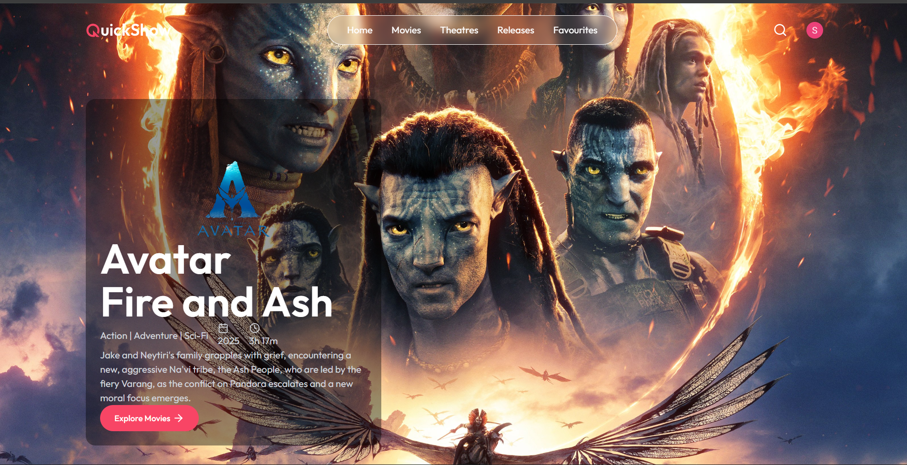

### Movies Now
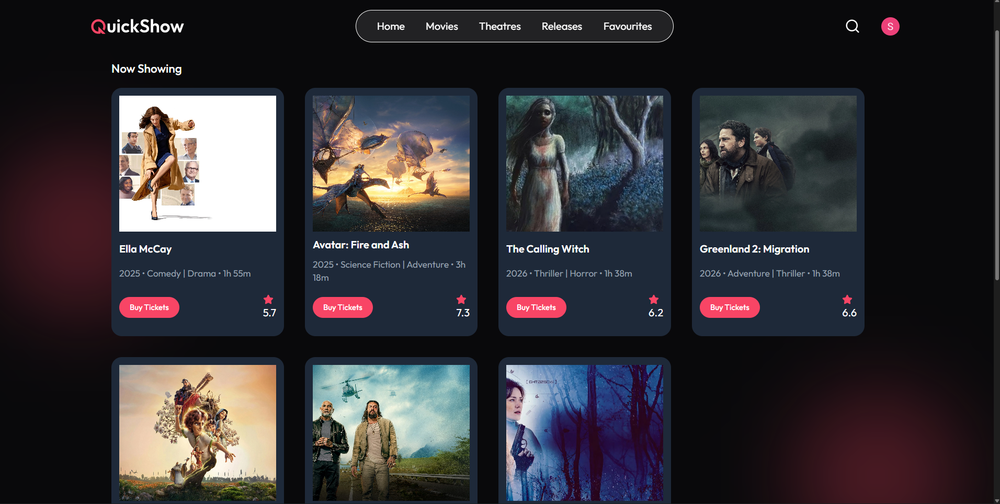

### Movie Details Page
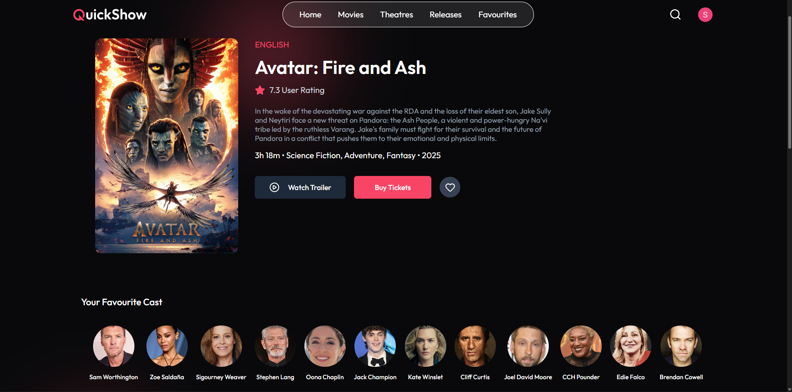

### Date Selection Page
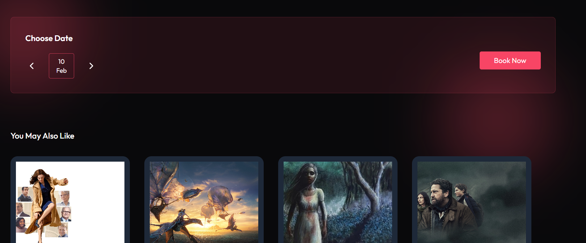

### Seat Selection Page
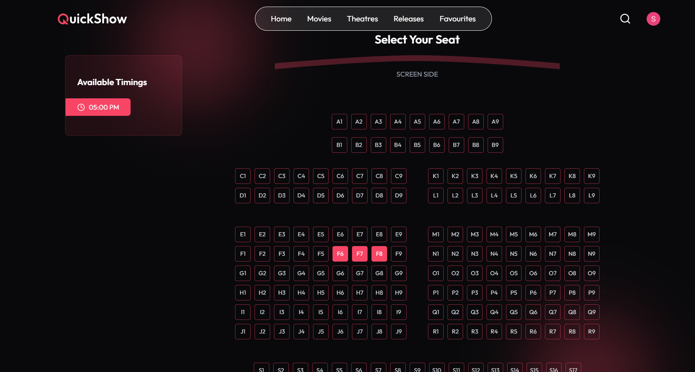

### Payment
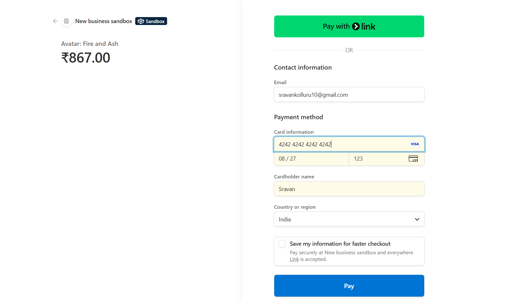

### Booking Confirmation Page
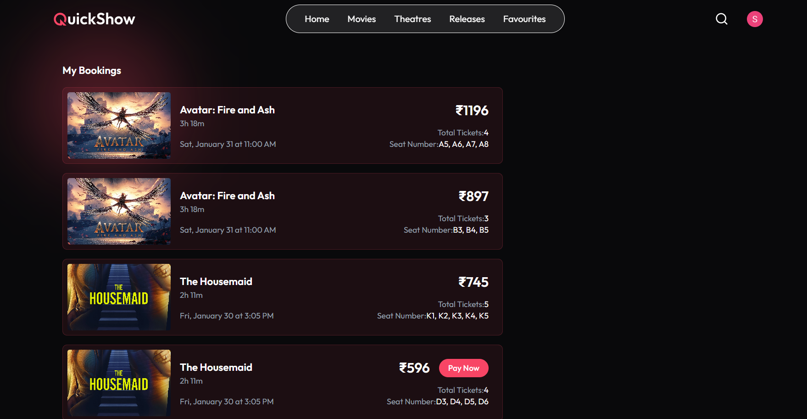

### Profile
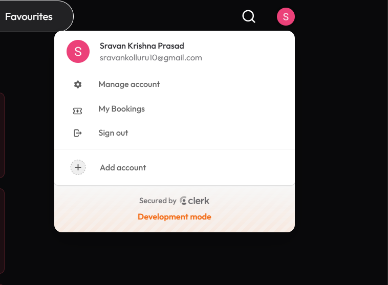

### Admin Dashboard
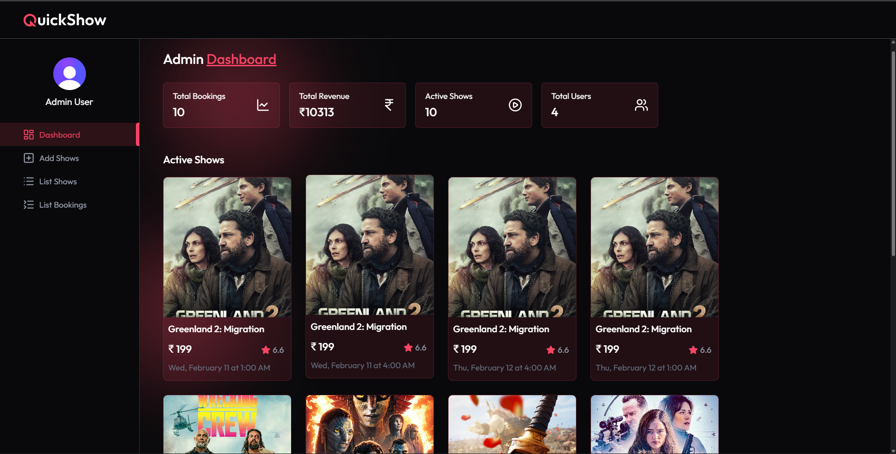

### Add Shows
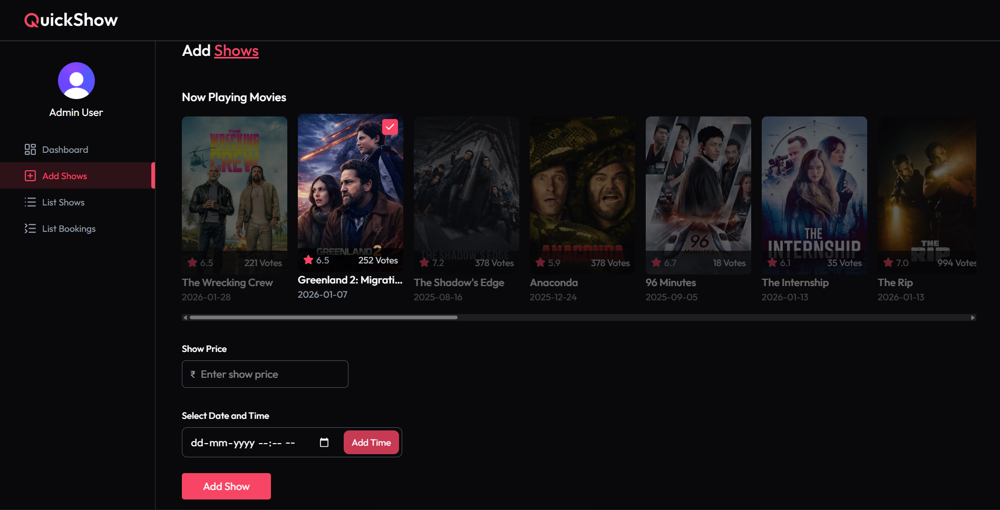

### List Shows
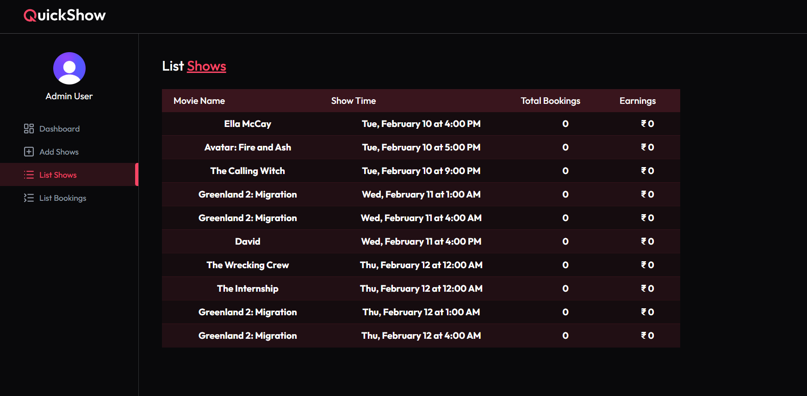

### List Bookings
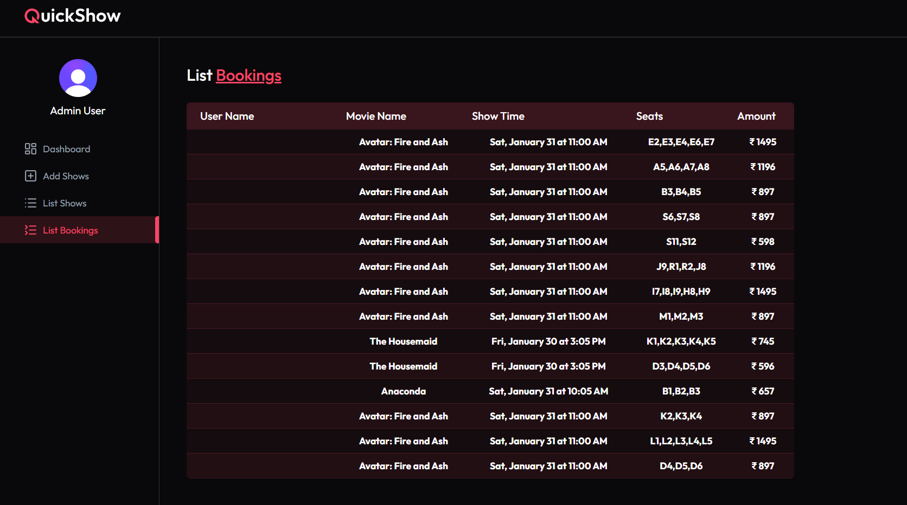


---

## 📚 Learning Outcomes

- Built a real-world React application
- Styled responsive UI using Tailwind CSS
- Integrated third-party APIs (TMDB)
- Implemented authentication using Clerk
- Learned booking system workflows and seat management
- Deployed a production-ready app using Vercel


---

## 📬 Contact

- GitHub: [Sravan1012](https://github.com/Sravan1012)


